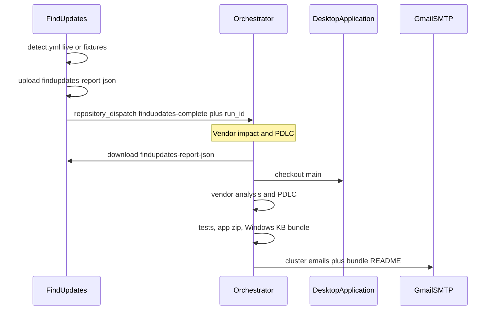

# Orchestrator

Control plane for [DesktopApplication](https://github.com/defrances/DesktopApplication). This repository does **not** start [FindUpdates](https://github.com/defrances/FindUpdates). Detect notifies here after it uploads `findupdates-report-json`.

One workflow, [Vendor impact and PDLC](.github/workflows/orchestrate.yml), runs after `findupdates-complete` (or from **Run workflow**):

1. Checkout DesktopApplication `main` and copy `docs/` into `inputs/`
2. Score **vendor impact** (station KB rows vs code/SBOM on `main`)
3. Score **product PDLC** (docs corpus vs `main`; station KBs are not product findings)
4. Run Smoke + Regression on that tree (release gate, not a product patch)
5. Publish the self-contained win-x64 exe
6. Assemble one **Windows patch bundle** from the matching FindUpdates `station_report`
7. Email results

Orchestrator does not apply product code patches and does not create GitHub Issues. Analysis is advisory. HOLD and BLOCK stay HOLD and BLOCK. Official `.msu` / `.cab` files are not copied into the zip.

## Two analyses

| Analysis | Input | Question | Output |
| --- | --- | --- | --- |
| Vendor impact | `inputs/report.json` + DesktopApplication `main` + optional SBOM | Does this host KB couple to a **file on main**? | `issues-out/` → one email per cluster |
| Product PDLC | `docs/architecture.md`, `mds2.md`, `test-plan.md`, `vulnerability-report.md` + `main` | Is each product finding's countermeasure present / absent / partial? | `pdlc-out/analysis.json` |

Vendor impact is **not** “the CVE is Critical”. A row is in scope only if a path on `main` would feel the change (`InsecureVendorBulletinClient`, WPF/`app.manifest`, `NoteStore`, self-contained publish). Scores:

| Field | Meaning |
| --- | --- |
| `required_for_app` | App fails without this KB (`required` only with a cited loader) |
| `install_risk` | Risk **if the KB is installed** |
| `skip_risk` | Risk **if the KB is skipped** |
| `compatibility` | Current `main` vs the proposed host bits |

Self-contained publish means an OS .NET KB almost never patches the bundled runtime (`os-dotnet` → `not_required`, `skip_risk: no_app_impact`). Rows that share workstation + `cluster_key` + the same four scores become **one** email. Cap 8 cluster files.

Product PDLC uses the docs as the finding list. Those files can lag `main` (for example VR-TLS-001 still marked open after the TLS callback was tightened). Station KB rows are not product vulnerabilities.

## Email

`SMTP_USERNAME` / `SMTP_PASSWORD` (Gmail App Password). From and To are that address.

| Message | When |
| --- | --- |
| One mail per vendor cluster | `issues-out/*.json` with title + body (markdown + HTML) |
| One status mail | No clusters |
| One Windows patch bundle mail | After the bundle README exists |

The bundle mail body is `artifacts/windows-bundle/**/README.md`. HTTPS markdown links and bare `https://` URLs become clickable `<a href>`. Footer links FindUpdates and Orchestrator runs.

## Windows patch bundle

WBS host-patch package: manifest + per-KB JSON + per-station JSON + `APPLY.ps1` + README. Microsoft installers are **not** inside the zip. `APPLY.ps1` inventories by default and only opens official URLs with `-Apply`.

`report.json` lists **all catalog stations**. Deploy rows are `candidate_for_validation` after FindUpdates SKU match (ProductID / CPE). Two 24H2 stations share ProductID `12390` and therefore the same 24H2 KBs.

## AI provider and model

Form fields on **Run workflow**, or repo variables on FindUpdates dispatch.

| Provider | Secret / token | Model field | Default model |
| --- | --- | --- | --- |
| `agent` (default) | `AGENT_API_KEY` plus vars `AGENT_SDK_PACKAGE` / `AGENT_SDK_MODULE` | `agent_model` / `AGENT_MODEL` | `composer-2.5` |
| `copilot` | `GITHUB_TOKEN` (`copilot-requests: write`) or `COPILOT_GITHUB_TOKEN` | `copilot_model` / `COPILOT_MODEL` | `claude-haiku-4.5` |
| `offline` | none | ignored | deterministic `fallback-*.py` |

A failed live provider falls back to offline so email and PDLC still finish. Package and module names stay in GitHub settings, not in this repository. `scripts/run-ai-analyze.py` loads the skill text and calls the selected provider.

Skills (same for every provider):

- [`.github/skills/analyze-vendor-update-impact/`](.github/skills/analyze-vendor-update-impact/) → `issues-out/`
- [`.github/skills/analyze-pdlc-release/`](.github/skills/analyze-pdlc-release/) → `pdlc-out/analysis.json`

## Secrets and variables

### `ORCHESTRATOR_PAT`

Fine-grained PAT (or classic `repo` PAT):

- [Orchestrator secrets](https://github.com/defrances/Orchestrator/settings/secrets/actions) — download FindUpdates artifacts, checkout DesktopApplication
- [FindUpdates secrets](https://github.com/defrances/FindUpdates/settings/secrets/actions) — `repository_dispatch` into this repo

| Repository | Permissions |
| --- | --- |
| `defrances/Orchestrator` | Contents: **Read and write** |
| `defrances/FindUpdates` | Actions: **Read** |
| `defrances/DesktopApplication` | Contents: read, Actions: read |

`GITHUB_TOKEN` cannot start workflows in another repository. This PAT does not need Issues write.

### Mail and analysis

| Name | Where | Role |
| --- | --- | --- |
| `SMTP_USERNAME` / `SMTP_PASSWORD` | Orchestrator secrets | Gmail login, From, To |
| `AGENT_API_KEY` | Orchestrator secrets | Live `agent` provider |
| `ORCHESTRATOR_AI_PROVIDER` | optional repo variable | Default provider on dispatch |
| `AGENT_SDK_PACKAGE` / `AGENT_SDK_MODULE` | repo variables | Analysis SDK install (settings only) |
| `AGENT_MODEL` / `COPILOT_MODEL` | repo variables | Dispatch defaults |

## Manual runs

**Vendor impact and PDLC** (same as FindUpdates notify):

- `findupdates_run_id` — FindUpdates run that uploaded `findupdates-report-json`
- `source` — `live` or `fixtures`
- `ai_provider` — `agent` / `copilot` / `offline`
- `agent_model` — ignored unless provider is `agent`
- `copilot_model` — ignored unless provider is `copilot`

**PDLC patch and release** is a product-only rerun (same scoring, tests, zip, optional bundle). Prefer the combined workflow after detect.

## Artifacts (14 days)

| Artifact | Contents |
| --- | --- |
| `orchestrator-analysis` | `inputs/report.json`, `issues-out/`, `pdlc-out/`, inventory |
| `windows-patch-bundle` | KB manifest zip + README + `APPLY.ps1` |
| `pdlc-release` | `PDLC_REPORT.md`, analysis, exe, tests, bundle copy |

## Related workflows

| Workflow | Repository | Role |
| --- | --- | --- |
| [Detect updates](https://github.com/defrances/FindUpdates/blob/main/.github/workflows/detect.yml) | FindUpdates | Daily live detect, upload report, notify this repo |
| [Vendor impact and PDLC](.github/workflows/orchestrate.yml) | Orchestrator | One follow-through run |
| [PDLC patch and release](.github/workflows/pdlc.yml) | Orchestrator | Manual product-only package |
| [CI](https://github.com/defrances/DesktopApplication/blob/main/.github/workflows/ci.yml) | DesktopApplication | Build, test, SBOM |
| [Release package](https://github.com/defrances/DesktopApplication/blob/main/.github/workflows/release.yml) | DesktopApplication | Versioned win-x64 zip from that repo |
