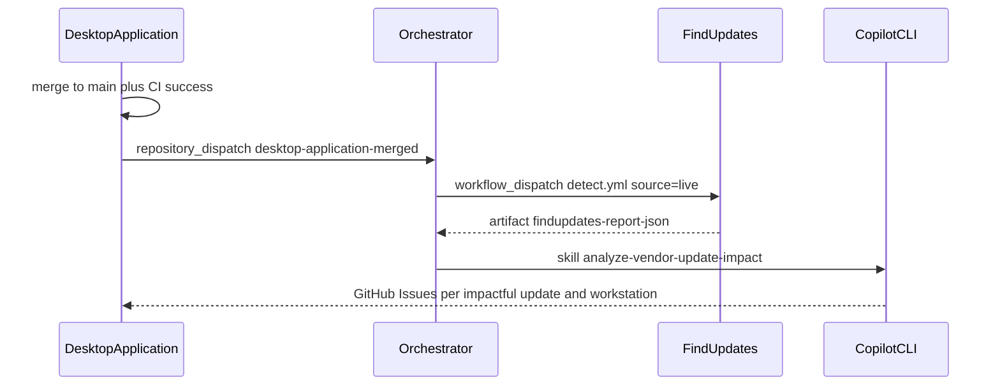

# Orchestrator

Cross-repository control plane for DesktopApplication.

After a successful CI run on `main` in [defrances/DesktopApplication](https://github.com/defrances/DesktopApplication), this repository:

1. Starts [FindUpdates `detect.yml`](https://github.com/defrances/FindUpdates/actions/workflows/detect.yml) with **`source=live`**
2. Downloads the `findupdates-report-json` artifact (`report.json`)
3. Runs the GitHub Copilot skill `analyze-vendor-update-impact` against DesktopApplication (code, recent commits, SBOM)
4. Opens GitHub Issues in DesktopApplication for updates that may affect the app **on a specific workstation**

The analysis is advisory only. It is not an authorization to install, approve, or deploy. HOLD and BLOCK stay HOLD and BLOCK.

## Workflows

| Workflow | Repository | Role |
| --- | --- | --- |
| [CI](https://github.com/defrances/DesktopApplication/blob/main/.github/workflows/ci.yml) | DesktopApplication | Build, test, SBOM |
| [Notify Orchestrator](https://github.com/defrances/DesktopApplication/blob/main/.github/workflows/notify-orchestrator.yml) | DesktopApplication | After successful `main` CI, dispatch this repo |
| [Orchestrate](.github/workflows/orchestrate.yml) | Orchestrator | Live detect, Copilot analysis, issue publish |
| [Detect updates](https://github.com/defrances/FindUpdates/blob/main/.github/workflows/detect.yml) | FindUpdates | Poll MSRC/Intel, station report |

## Secrets

Create a fine-grained PAT (or classic `repo` + `workflow` PAT) that can:

| Repository | Permissions |
| --- | --- |
| `defrances/Orchestrator` | Contents: read and write (so DesktopApplication can send `repository_dispatch`) |
| `defrances/FindUpdates` | Actions: read and write (dispatch `detect.yml`, download artifacts) |
| `defrances/DesktopApplication` | Contents: read, Actions: read, Issues: write (checkout, SBOM artifact, create issues) |

Store it as **`ORCHESTRATOR_PAT`** in:

- [DesktopApplication secrets](https://github.com/defrances/DesktopApplication/settings/secrets/actions)
- [Orchestrator secrets](https://github.com/defrances/Orchestrator/settings/secrets/actions)

Optional: **`COPILOT_GITHUB_TOKEN`** in Orchestrator, with Copilot Requests enabled. If unset, the workflow falls back to `ORCHESTRATOR_PAT` / `GITHUB_TOKEN` with `copilot-requests: write`.

Without these secrets, dispatch, artifact download, Copilot, and issue creation cannot run.

## Manual run

Actions → **Orchestrate vendor impact analysis** → **Run workflow**.

Inputs:

- `sha` — DesktopApplication ref (default `main`)
- `ci_run_id` — optional CI run id, used to download the `sbom` artifact

## Copilot skill

[`.github/skills/analyze-vendor-update-impact/`](.github/skills/analyze-vendor-update-impact/)

The skill reads `inputs/report.json`, inspects `workspace/DesktopApplication`, and writes JSON under `issues-out/`. A separate script publishes Issues so the model does not get a write token for `gh issue create`.

## Issues in DesktopApplication

Look at [DesktopApplication Issues](https://github.com/defrances/DesktopApplication/issues?q=is%3Aissue+label%3Avendor-update-impact) labeled `vendor-update-impact`.

Each issue names:

- which vendor update may affect the app
- which workstation (`device_id`, OS, role)
- evidence from recent DesktopApplication code / SBOM

At most 20 individual issues are opened per run. Overflow is one summary issue. Duplicates of an open `advisory_id` + `device_id` pair are skipped.

## Artifacts

Orchestrator uploads `orchestrator-analysis` (`inputs/report.json` and `issues-out/**`), retained 14 days.
