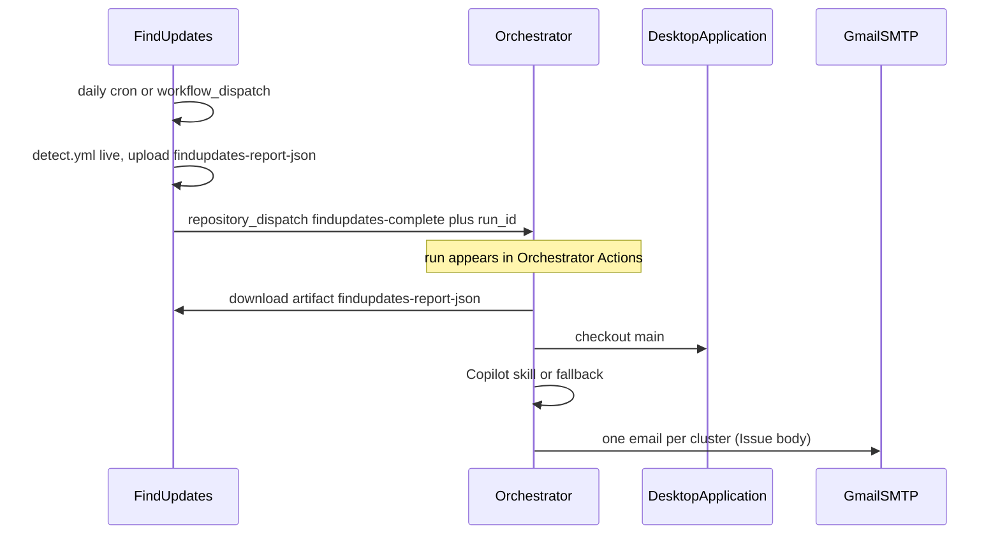

# Orchestrator

Cross-repository control plane for DesktopApplication.

[FindUpdates](https://github.com/defrances/FindUpdates) runs **once per day** (and manually). After that job finishes it notifies **this** repository and points at the `findupdates-report-json` artifact. This repository never starts FindUpdates (that would loop).

1. FindUpdates `detect.yml` (schedule or `workflow_dispatch`) uploads `findupdates-report-json`
2. FindUpdates sends `repository_dispatch` (`findupdates-complete`) with the FindUpdates **run id**
3. [This workflow](https://github.com/defrances/Orchestrator/actions) downloads `report.json`, checks out [DesktopApplication `main`](https://github.com/defrances/DesktopApplication/tree/main), and runs the Copilot skill `analyze-vendor-update-impact` (or the deterministic fallback)
4. Results are **always emailed** to the address in `SMTP_USERNAME`: **one email per cluster**, with the same title and sections as the former GitHub Issues (`Updates in this cluster`, Workstation, Evidence, Risk, How this can affect, Recent code, Recommended action). In the Updates table, only **Package** links to that row's `official_url` from FindUpdates when the URL is `https://`. Overflow uses the summary payload. If there are no clusters, one status email is sent.
5. The same run builds a **Windows patch bundle** (`windows-patch-bundle`): one zip of host KBs grouped for deploy (manifest, per-KB / per-station JSON, `APPLY.ps1`). Candidate rows are the deploy set; HOLD/BLOCK stay in the bundle as do-not-install. Official `.msu`/`.cab` files are not copied in — `APPLY.ps1` opens vendor URLs. This is the host patch-package step of the PDLC WBS.
6. GitHub Issues are **not** created

The analysis is advisory only. It is not an authorization to install, approve, or deploy. HOLD and BLOCK stay HOLD and BLOCK.

## Where each run appears

| Step | Repository | Actions URL |
| --- | --- | --- |
| Daily / manual detect | FindUpdates | https://github.com/defrances/FindUpdates/actions/workflows/detect.yml |
| Orchestrate (this pipeline) | Orchestrator | https://github.com/defrances/Orchestrator/actions |
| Build, test, SBOM | DesktopApplication | https://github.com/defrances/DesktopApplication/actions |
| Results email | Gmail | From and to the `SMTP_USERNAME` secret |

## Workflows

| Workflow | Repository | Role |
| --- | --- | --- |
| [Detect updates](https://github.com/defrances/FindUpdates/blob/main/.github/workflows/detect.yml) | FindUpdates | Daily live detect, upload `report.json`, notify this repo |
| [Orchestrate](.github/workflows/orchestrate.yml) | Orchestrator | Download report, AI analysis, Windows KB bundle, always email |
| [PDLC patch and release](.github/workflows/pdlc.yml) | Orchestrator | Product corpus → countermeasures → tests → app zip + Windows KB bundle |
| [CI](https://github.com/defrances/DesktopApplication/blob/main/.github/workflows/ci.yml) | DesktopApplication | Build, test, SBOM (does not start Orchestrator) |
| [Release package](https://github.com/defrances/DesktopApplication/blob/main/.github/workflows/release.yml) | DesktopApplication | Versioned win-x64 zip from this repo |

## Secrets

### `ORCHESTRATOR_PAT`

Fine-grained PAT (or classic `repo` PAT) stored in:

- [Orchestrator secrets](https://github.com/defrances/Orchestrator/settings/secrets/actions) — download FindUpdates artifacts, checkout DesktopApplication
- [FindUpdates secrets](https://github.com/defrances/FindUpdates/settings/secrets/actions) — `repository_dispatch` into this repo

| Repository | Permissions |
| --- | --- |
| `defrances/Orchestrator` | Contents: **Read and write** (`repository_dispatch` from FindUpdates) |
| `defrances/FindUpdates` | Actions: **Read** (download `findupdates-report-json`) |
| `defrances/DesktopApplication` | Contents: read, Actions: read (checkout `main`, optional SBOM artifact) |

This PAT does **not** need Actions write on FindUpdates or Issues write on DesktopApplication. `GITHUB_TOKEN` cannot start workflows in another repository.

Analysis steps pick a provider with **`ai_provider`** (`agent`, `copilot`, `offline`). Default is `agent`.

| Provider | Secret / token | What runs |
| --- | --- | --- |
| `agent` | `AGENT_API_KEY` | Local analysis SDK (`scripts/run-ai-analyze.py`) |
| `copilot` | `GITHUB_TOKEN` (`copilot-requests: write`) or `COPILOT_GITHUB_TOKEN` | GitHub Copilot CLI |
| `offline` | none | Deterministic fallback scripts |

If the selected live provider fails, the same script falls back to offline analysis so email / PDLC still complete. Optional repo variable **`ORCHESTRATOR_AI_PROVIDER`** sets the default for scheduled `repository_dispatch` (no workflow input).

### Gmail SMTP (required for the results email)

Create a Gmail [App Password](https://support.google.com/accounts/answer/185833) (2FA required). A normal Gmail password is rejected. Store in [Orchestrator secrets](https://github.com/defrances/Orchestrator/settings/secrets/actions):

| Secret | Value |
| --- | --- |
| `SMTP_USERNAME` | Gmail address used as SMTP login, From, and To |
| `SMTP_PASSWORD` | Gmail App Password for Mail |

From and To come from `SMTP_USERNAME`. The password is never written to logs or artifacts. The email step runs with `if: always()`. Each cluster is a separate message (`multipart/alternative` markdown + HTML). Subject is the Issue title.

## Product PDLC (separate from vendor-update email)

[FindUpdates](https://github.com/defrances/FindUpdates) station reports are **not** the product vulnerability input. Product PDLC uses DesktopApplication `docs/` (architecture, MDS2-lite, test plan, vulnerability report) plus the `main` checkout.

Actions → **PDLC patch and release** → **Run workflow** (`.github/workflows/pdlc.yml`). Choose **`ai_provider`**: `agent` (default), `copilot`, or `offline`. For `agent`, store **`AGENT_API_KEY`** in Orchestrator secrets.

That run:

1. Reads the PDLC corpus and scores countermeasures (`scripts/run-ai-analyze.py`, default provider `agent`)
2. Runs DesktopApplication Smoke + Regression tests against `main` as-is
3. Publishes a self-contained win-x64 exe and zips `pdlc-release` (`PDLC_REPORT.md`, `RELEASE_NOTES.md`, `TEST_RESULTS.md`, exe)
4. If a FindUpdates `station_report` is available, also builds the **Windows patch bundle** (same format as Orchestrate) and includes it in `pdlc-release`

Orchestrator does not apply product code patches. It scores whatever is already on DesktopApplication `main` and packages that tree.

Host OS KBs are **bundled as a deployable manifest** (WBS item 3), not baked into the client exe. Microsoft installers are not redistributed inside the zip.

## Manual run

Actions → **Orchestrate vendor impact analysis** → **Run workflow**.

Inputs:

- `findupdates_run_id` — FindUpdates Actions run that uploaded `findupdates-report-json`
- `source` — optional (`live` or `fixtures`) recorded in the email footer
- `ai_provider` — `agent` (default), `copilot`, or `offline`

## Copilot skill

[`.github/skills/analyze-vendor-update-impact/`](.github/skills/analyze-vendor-update-impact/)

Skills stay the same regardless of provider:

- [`.github/skills/analyze-vendor-update-impact/`](.github/skills/analyze-vendor-update-impact/) → `issues-out/` then email
- [`.github/skills/analyze-pdlc-release/`](.github/skills/analyze-pdlc-release/) → `pdlc-out/analysis.json`

`scripts/run-ai-analyze.py` loads the skill text and calls the selected provider.

## Artifacts

Orchestrator uploads `orchestrator-analysis` (`inputs/report.json` and `issues-out/**`) and `windows-patch-bundle` (KB manifest zip), retained 14 days. The live detect artifacts stay on the FindUpdates run. Each email links to that FindUpdates run and names the bundle artifact.
