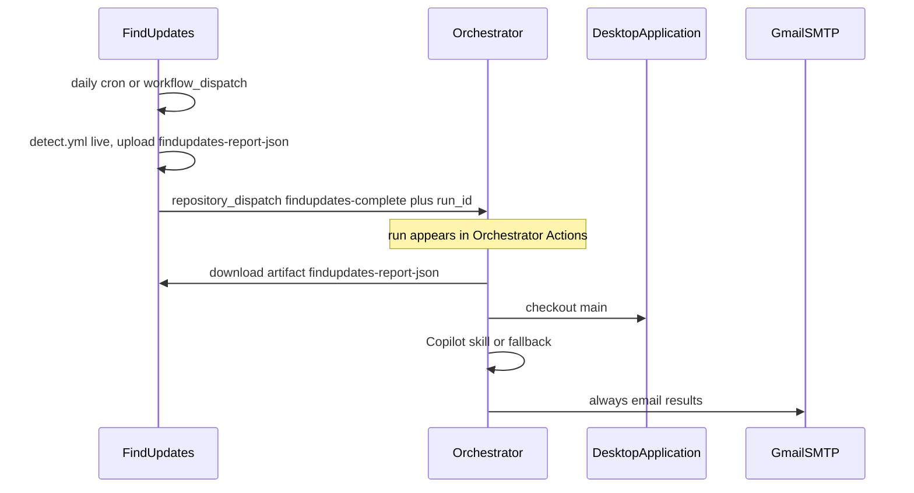

# Orchestrator

Cross-repository control plane for DesktopApplication.

[FindUpdates](https://github.com/defrances/FindUpdates) runs **once per day** (and manually). After that job finishes it notifies **this** repository and points at the `findupdates-report-json` artifact. This repository never starts FindUpdates (that would loop).

1. FindUpdates `detect.yml` (schedule or `workflow_dispatch`) uploads `findupdates-report-json`
2. FindUpdates sends `repository_dispatch` (`findupdates-complete`) with the FindUpdates **run id**
3. [This workflow](https://github.com/defrances/Orchestrator/actions) downloads `report.json`, checks out [DesktopApplication `main`](https://github.com/defrances/DesktopApplication/tree/main), and runs the Copilot skill `analyze-vendor-update-impact` (or the deterministic fallback)
4. Results are **always emailed** to `andrey02061987@gmail.com`, including when analysis or the report download fails
5. GitHub Issues are **not** created

The analysis is advisory only. It is not an authorization to install, approve, or deploy. HOLD and BLOCK stay HOLD and BLOCK.

## Where each run appears

| Step | Repository | Actions URL |
| --- | --- | --- |
| Daily / manual detect | FindUpdates | https://github.com/defrances/FindUpdates/actions/workflows/detect.yml |
| Orchestrate (this pipeline) | Orchestrator | https://github.com/defrances/Orchestrator/actions |
| Build, test, SBOM | DesktopApplication | https://github.com/defrances/DesktopApplication/actions |
| Results email | Gmail | From and to `andrey02061987@gmail.com` |

## Workflows

| Workflow | Repository | Role |
| --- | --- | --- |
| [Detect updates](https://github.com/defrances/FindUpdates/blob/main/.github/workflows/detect.yml) | FindUpdates | Daily live detect, upload `report.json`, notify this repo |
| [Orchestrate](.github/workflows/orchestrate.yml) | Orchestrator | Download report, Copilot analysis, always email |
| [CI](https://github.com/defrances/DesktopApplication/blob/main/.github/workflows/ci.yml) | DesktopApplication | Build, test, SBOM (does not start Orchestrator) |

## Secrets

### `ORCHESTRATOR_PAT`

Fine-grained PAT (or classic `repo` PAT) stored in:

- [Orchestrator secrets](https://github.com/defrances/Orchestrator/settings/secrets/actions) — download FindUpdates artifacts, checkout DesktopApplication
- [FindUpdates secrets](https://github.com/defrances/FindUpdates/settings/secrets/actions) — `repository_dispatch` into this repo

| Repository | Permissions |
| --- | --- |
| `defrances/Orchestrator` | Contents: **Read and write** (`repository_dispatch` from FindUpdates) |
| `defrances/FindUpdates` | Actions: **Read** (download `findupdates-report-json`) |
| `defrances/DesktopApplication` | Contents: read, Actions: read (checkout `main`, optional SBOM artifact) |

This PAT does **not** need Actions write on FindUpdates or Issues write on DesktopApplication. `GITHUB_TOKEN` cannot start workflows in another repository.

The Copilot skill step authenticates with `GITHUB_TOKEN` and `permissions: copilot-requests: write` (no PAT). Optional **`COPILOT_GITHUB_TOKEN`** overrides that. If Copilot CLI cannot authenticate, the workflow uses deterministic fallback analysis and still emails.

### Gmail SMTP (required for the results email)

Create a Gmail [App Password](https://support.google.com/accounts/answer/185833) (2FA required). A normal Gmail password is rejected. Store in [Orchestrator secrets](https://github.com/defrances/Orchestrator/settings/secrets/actions):

| Secret | Value |
| --- | --- |
| `SMTP_USERNAME` | `andrey02061987@gmail.com` |
| `SMTP_PASSWORD` | Gmail App Password for Mail |

From and To are `andrey02061987@gmail.com`. The password is never written to logs or artifacts. The email step runs with `if: always()`.

## Manual run

Actions → **Orchestrate vendor impact analysis** → **Run workflow**.

Inputs:

- `findupdates_run_id` — FindUpdates Actions run that uploaded `findupdates-report-json`
- `source` — optional (`live` or `fixtures`) for the email body

## Copilot skill

[`.github/skills/analyze-vendor-update-impact/`](.github/skills/analyze-vendor-update-impact/)

The skill always analyzes the full [DesktopApplication `main`](https://github.com/defrances/DesktopApplication/tree/main) checkout. It scores each vendor row both ways: risk if the update is **installed** and risk if it is **skipped**. It reads `inputs/report.json` and writes JSON under `issues-out/`. Those files are emailed and uploaded as artifacts. They are **not** published as GitHub Issues.

## Artifacts

Orchestrator uploads `orchestrator-analysis` (`inputs/report.json` and `issues-out/**`), retained 14 days. The live detect artifacts stay on the FindUpdates run. The email links to that FindUpdates run instead of attaching the full JSON.
